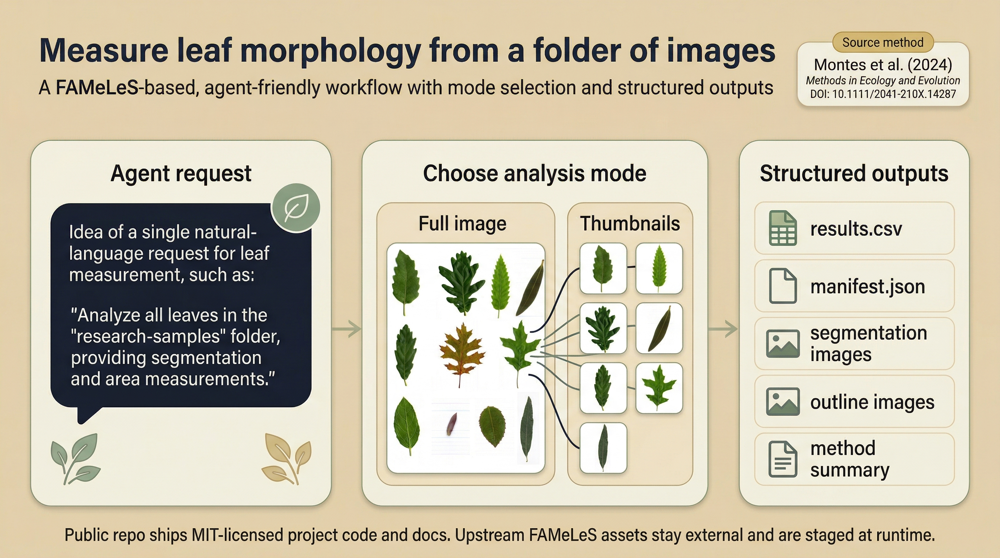

# leaf-measure

基于已发表 FAMeLeS 方法的叶片形态测量仓库与 Skill。它把 Fiji 宏工作流包装成可由 agent 调用、可在新数据上复用、并且可验证的分析流程。
这个仓库包含共享 Python engine、canonical skill 源，以及生成到 `.agents` / `.claude` 的 repo-local skills，不是只有一个独立 skill 包。



<a id="chinese"></a>

中文 | [English](#english)

---

## 中文

### 这是什么

`leaf-measure` 面向这样一句话请求：

`Measure leaf area, perimeter, length, width, circularity, and solidity for the images in this folder.`

它保留论文方法的科学核心不变：

- 原始 FAMeLeS 宏仍然是方法核心
- Fiji 仍然是执行引擎
- 共享 Python CLI 把流程变成稳定接口
- 轻量 Skill 让 Codex / Claude Code 可以直接调用

### 能测什么

对每个检测到的叶对象，输出：

- 面积 `Area`
- 周长 `Perim.`
- 长度 `Length`
- 宽度 `Width`
- 圆形度 `Circ.`
- 实体度 `Solidity`

默认单位是像素。若图像中存在 DPI 元数据，程序会记录并提示如何换算，但不会自动改成物理单位。

### 两种分析模式

- `Full image`
  - 保留整张原图
  - 对图中所有叶片做测量
  - 输出整图的二值分割图和轮廓图
- `Thumbnails`
  - 除了测量结果，还会把每片叶子单独导出
  - 适合后续逐叶检查或构建单叶数据集

直观例子：

- `Full image`：一张图里有 5 片叶子，输出结果表里有这 5 片叶子的 5 行记录，同时输出该整张图的二值图和轮廓图
- `Thumbnails`：同样是 5 行记录，但还会额外导出 5 张单独叶片裁切图，以及对应的单叶二值图和轮廓图

### 自动修复说明

`leaf-measure` 默认优先保留原始 FAMeLeS 计算路径，尤其是在未命中伪影判据的正常图像上。

- `Full image`：如果二值图出现“边缘连通背景包住叶片”的失真形态，程序会先移除该背景伪影，再重新测量
- `Thumbnails`：会先做一个轻量预判，检查输入图像是否存在明显的暗色边缘伪影；命中时直接走更稳的修复路径，未命中时继续走原始 FAMeLeS 宏路径
- 对未命中该判据的图像，`Thumbnails` 不会先跑额外的整图探测流程，因此正常样本更快，也不会静默改写默认行为

运行完成后，请查看：

- `run_summary.md`：是否触发了自动修复
- `method_summary.md`：本次运行走的是原始路径还是修复路径
- 二值图和轮廓图：用于快速复核自动分割是否合理

### 给 Agent 用户

如果你平时就是对 Codex / Claude Code 说一句话来完成安装和分析，这个仓库应该这样用：

1. 让 agent 打开这个仓库作为工作区
2. 对 agent 说：

```text
Set up this project, detect Fiji, explain Full image vs Thumbnails if I have not chosen a mode, and run leaf measurement on my image folder.
```

或者更具体一点：

```text
Use leaf-measure to analyze this folder. If I have not specified Full image or Thumbnails, explain the difference and ask me to choose. Then report area, perimeter, length, width, circularity, and solidity.
```

仓库已经给 agent 准备好了：

- 共享 CLI：`python -m engine.cli analyze ...`
- canonical skill 源：`skills/leaf-fameles/`
- 生成的 repo-local skills：
  - `.agents/skills/leaf-fameles/`
  - `.claude/skills/leaf-fameles/`
- 运行时模板：`config/runtime.example.toml`
- 自动 bootstrap 脚本：`scripts/bootstrap.ps1`
- 上游资源 staging 脚本：`scripts/stage-assets.ps1`
- skill 同步脚本：`scripts/sync-skills.ps1`

如果你不想每次都先打开整个仓库，也可以把 canonical skill 单独安装到全局技能目录：

```powershell
python -m engine.cli install-skill
```

默认会安装到 `$CODEX_HOME/skills/leaf-fameles`（未设置 `CODEX_HOME` 时为 `~/.codex/skills/leaf-fameles`）。
安装后，skill 自带的 `scripts/setup_and_analyze.py` 会在首次运行时把共享仓库克隆或更新到 `$CODEX_HOME/vendor/leaf-measure`，然后自动执行 `doctor` 和 `bootstrap`。

也就是说，对 agent 用户来说，重点不是“先看 pip 怎么装”，而是：

- 仓库能不能被 agent 直接理解
- skill 能不能被发现
- 运行时能不能自动探测
- 结果是不是结构化输出

推荐先让 agent 直接运行：

```text
Run .\scripts\bootstrap.ps1 to install Python dependencies for the current environment, download Fiji if it is missing, fetch the public Figshare assets if they are missing, and write a machine-readable doctor report.
```

如果你只想补齐其中一项，也可以继续让 agent 做下面这些事：

```text
Search this machine for fiji-windows-x64.exe, then run leaf-measure with that Fiji path.
```

最直接的覆盖方式是给 CLI 显式传入：

```powershell
python -m engine.cli analyze --input "<folder>" --output "<run-dir>" --mode full --fiji "D:\path\to\Fiji"
```

如果只缺上游宏和试验包，先让 agent 做这件事：

```text
Run python -m engine.cli fetch-assets, then run leaf-measure with that assets path.
```

对应命令：

```powershell
python -m engine.cli fetch-assets
python -m engine.cli analyze --input "<folder>" --output "<run-dir>" --mode full --assets ".\.leaf-measure-assets"
```

如果你已经把 canonical skill 安装到了全局目录，也可以直接在已安装 skill 目录中让 agent 调这个 helper：

```text
Run python scripts/setup_and_analyze.py analyze --input "<folder>" --output "<run-dir>" --mode full from the installed leaf-fameles skill directory.
```

### 手动安装

如果你想手动安装或排查环境，再看这一节。

#### 1. 克隆仓库

```powershell
git clone https://github.com/Rimagination/leaf-measure.git leaf-measure
cd leaf-measure
```

如果你还在本地开发阶段，没有公开仓库地址，也可以直接在现有目录中使用：

```powershell
cd D:\path\to\leaf-measure
```

#### 2. 最简单的安装方式

```powershell
.\scripts\bootstrap.ps1
```

它会：

- 在当前 Python 环境中安装 `leaf-measure`
- 如果本地缺少 Fiji，就从官方地址下载
- 如果本地缺少上游宏和 `Trial.zip`，就从论文指向的 Figshare 资源页拉取并 stage 到 `.leaf-measure-assets/`
- 在 `config/doctor.json` 中写出 machine-readable 的运行环境报告

#### 3. 手动创建 Python 环境并安装依赖

```powershell
python -m venv .venv
.\.venv\Scripts\Activate.ps1
python -m pip install -U pip
python -m pip install -e .[dev]
```

#### 4. 手动准备 Fiji

你需要本地 Fiji 安装。推荐做法：

- 直接把 Fiji 放到仓库旁边或仓库内，便于自动发现
- 或者在 `config/runtime.toml` / `FIJI_DIR` 中显式指定路径

你也可以单独自动下载：

```powershell
python -m engine.cli fetch-fiji
```

#### 5. 生成本地运行时配置

```powershell
Copy-Item config\runtime.example.toml config\runtime.toml
```

或：

```powershell
.\scripts\bootstrap.ps1
```

或单独写出诊断报告：

```powershell
python -m engine.cli doctor --output config\doctor.json
```

#### 6. 如果只想单独准备上游资源

```powershell
python -m engine.cli fetch-assets
```

如果你已经手动下载并解压了上游包，也可以继续使用本地 staging：

```powershell
.\scripts\stage-assets.ps1 -SourceRoot "<downloaded-or-extracted-upstream-package>"
```

### 手动运行

#### 1. 环境要求

- Python 3.11+
- 本地 Fiji 安装
- 当前仓库已验证的平台是 Windows

#### 2. 配置运行时

运行时路径按以下优先级解析：

1. CLI 参数
2. `config/runtime.toml`
3. 环境变量，如 `FIJI_DIR`
4. 仓库附近的常见安装路径自动发现

复制模板：

```powershell
Copy-Item config\runtime.example.toml config\runtime.toml
```

或直接运行：

```powershell
.\scripts\bootstrap.ps1
```

#### 3. 执行分析

`Full image`：

```powershell
python -m engine.cli analyze --input "D:\path\to\images" --output "D:\path\to\run-full" --mode full
```

`Thumbnails`：

```powershell
python -m engine.cli analyze --input "D:\path\to\images" --output "D:\path\to\run-thumbnails" --mode thumbnails
```

### 输出内容

每次运行都会生成：

- `results.csv`
- `results_fameles_particles_raw.csv`（仅 `Thumbnails` 且命中原始粒子级导出时）
- `manifest.json`
- `run_summary.md`
- `method_summary.md`
- `trait_explanations.md`

模式相关输出：

- `full`
  - `01b_bandpass/`
  - `01c_contrasted/`
  - `02_area/`
  - `03_outline/`
- `thumbnails`
  - `01a_bandpass/`
  - `01b_contrasted/`
  - `02_thumbnails/`
  - `03_area/`
  - `04_outline/`

在 `Thumbnails` 模式下，`leaf-measure` 默认把 `results.csv` 整理成“一张导出的单叶图一行”。如果原始 FAMeLeS 第二步测量在某些单叶图中检测到了多个粒子，原始粒子级结果会保留在 `results_fameles_particles_raw.csv`，方便追溯。

### 为什么可信

仓库包含：

- 自动回归测试：`tests/`
- 外部 assets 目录中的参考输入与 golden 输出

说明：

- 本仓库已经采用 Option B
- 上游宏、试验输入和 golden 输出默认不再随公开仓库分发
- 本地验证请使用 `.leaf-measure-assets/` 或其他外部 assets 目录

当前测试覆盖：

- 运行时解析逻辑
- 宏 patch 逻辑
- `Full image` 对参考输出复现
- `Thumbnails` 对参考输出复现
- 自动修复路径对异常掩膜的单元测试

运行测试：

```powershell
python -m pytest tests -q
```

### 方法忠实性

论文指出上游 FAMeLeS 资源来自 Figshare DOI：`10.6084/m9.figshare.22354405`。

本仓库已采用 Option B：上游宏和参考数据默认放在仓库外部的 assets 目录中。运行时只会读取这些外部资源，并在临时工作目录中生成 patched 宏副本。

相关说明见：

- `docs/method.md`
- `docs/licensing.md`
- `docs/validation.md`
- `docs/limitations.md`

### 许可证

本仓库自写代码和文档采用 [MIT License](LICENSE.md)。

边界说明：

- MIT 许可适用于当前仓库中由 `leaf-measure` 项目编写的代码、脚本、文档和 skill 定义
- 上游 FAMeLeS 宏、试验输入和 golden 输出默认不随公开仓库分发
- 这些外部 assets 需要按其原始来源和原始条款单独获取，不受本仓库 MIT 许可覆盖

相关说明见：

- `docs/licensing.md`
- `docs/public-release-strategy.md`

### 当前执行策略

基线执行器是 Fiji 的 `-batch` 模式直接调用。

- `Full image`：已作为基线路径支持
- `Thumbnails`：当前也可运行，但仍应在目标环境上验证显示相关行为
- `PyImageJ interactive`：保留为可选增强路径，不是默认执行器
- `PyImageJ headless`：不是本项目的默认支持路径

### 已知限制

- 默认输出仍是像素单位
- 分割质量仍受图像质量、背景和对比度影响
- `PyImageJ interactive` 有平台依赖：
  - macOS 需要图形会话
  - Linux 服务器或容器通常需要 `Xvfb`
- `Thumbnails` 依赖 legacy ImageJ 行为，部署前应在目标环境验证

---

<a id="english"></a>

[中文](#chinese) | English

## English

### Overview

`leaf-measure` packages the published Fiji-based FAMeLeS workflow into a repo and skill that agents can run on new folders of leaf images.
It is a shared Python engine plus a canonical skill source, not only a standalone skill package.


The target request is:

`Measure leaf area, perimeter, length, width, circularity, and solidity for the images in this folder.`

It keeps the scientific core fixed:

- original FAMeLeS macros remain the method core
- Fiji remains the execution engine
- a shared Python CLI provides a stable interface
- lightweight skills make the workflow callable from Codex and Claude Code

### Traits

For each detected leaf object, the workflow reports:

- `Area`
- `Perim.`
- `Length`
- `Width`
- `Circ.`
- `Solidity`

Outputs are in pixels by default. If DPI metadata is present, the run records it and explains conversion, but does not silently switch units.

### Modes

- `Full image`
  - keeps the whole source image intact
  - measures all leaves in the scene
  - writes full-image binary and outline outputs
- `Thumbnails`
  - also exports each detected leaf as its own cropped artifact

Example:

- `Full image`: one image contains 5 leaves, and the run produces 5 measured rows plus one binary image and one outline image for the full scene
- `Thumbnails`: the same image still produces 5 measured rows, but also exports 5 individual leaf crops plus per-leaf binary and outline artifacts

### Automatic Repair Behavior

`leaf-measure` preserves the published FAMeLeS path by default and only applies repairs when it detects a specific artifact pattern.

- `Full image`: if the binary mask shows an edge-connected background region enclosing the leaves, the run removes that artifact and re-measures the corrected mask
- `Thumbnails`: the run first performs a lightweight preflight on the source image to detect strong dark-edge artifacts; affected scans go straight to the stable repair path, while unaffected images continue to use the original FAMeLeS thumbnails macro path
- this avoids an unnecessary full-image probe on clean thumbnail jobs

After each run, check:

- `run_summary.md` to see whether automatic repair was triggered
- `method_summary.md` to see whether the run stayed on the original path or used the repair path
- binary and outline outputs for a quick visual review

### For Agent Users

If you normally install and use projects by telling Codex or Claude Code to do it for you, this repository should be used that way.

Open the repository as the workspace and say:

```text
Set up this project, detect Fiji, explain Full image vs Thumbnails if I have not chosen a mode, and run leaf measurement on my image folder.
```

Or more specifically:

```text
Use leaf-measure to analyze this folder. If I have not specified Full image or Thumbnails, explain the difference and ask me to choose. Then report area, perimeter, length, width, circularity, and solidity.
```

The repository already gives agents what they need:

- a shared CLI: `python -m engine.cli analyze ...`
- a canonical skill source: `skills/leaf-fameles/`
- generated repo-local skills:
  - `.agents/skills/leaf-fameles/`
  - `.claude/skills/leaf-fameles/`
- a runtime template: `config/runtime.example.toml`
- an automatic bootstrap script: `scripts/bootstrap.ps1`
- an upstream-asset staging script: `scripts/stage-assets.ps1`
- a skill sync script: `scripts/sync-skills.ps1`

If you do not want to open the whole repository every time, you can also install the canonical skill into your global skill directory:

```powershell
python -m engine.cli install-skill
```

By default this installs to `$CODEX_HOME/skills/leaf-fameles` (or `~/.codex/skills/leaf-fameles` when `CODEX_HOME` is unset).
The bundled `scripts/setup_and_analyze.py` helper then clones or updates the shared repo cache under `$CODEX_HOME/vendor/leaf-measure` and runs `doctor` plus `bootstrap` on first use.

For agent-native users, the important thing is not leading with `pip install`, but making sure:

- the repository is understandable to the agent
- the skill can be discovered
- runtime resolution is explicit
- outputs are structured

The recommended first step for an agent is:

```text
Run .\scripts\bootstrap.ps1 to install Python dependencies for the current environment, download Fiji if it is missing, fetch the public Figshare assets if they are missing, and write a machine-readable doctor report.
```

If you only want to override one missing component, tell the agent to continue with:

```text
Search this machine for fiji-windows-x64.exe, then run leaf-measure with that Fiji path.
```

The most direct override is:

```powershell
python -m engine.cli analyze --input "<folder>" --output "<run-dir>" --mode full --fiji "D:\path\to\Fiji"
```

If the run only needs the public upstream macros and trial package, tell the agent to do this first:

```text
Run python -m engine.cli fetch-assets, then run leaf-measure with that assets path.
```

Equivalent commands:

```powershell
python -m engine.cli fetch-assets
python -m engine.cli analyze --input "<folder>" --output "<run-dir>" --mode full --assets ".\.leaf-measure-assets"
```

If you have already installed the canonical skill globally, you can also tell the agent to run the bundled helper from the installed skill directory:

```text
Run python scripts/setup_and_analyze.py analyze --input "<folder>" --output "<run-dir>" --mode full from the installed leaf-fameles skill directory.
```

### Manual Installation

If you want to install or debug the environment yourself, use this section.

#### 1. Clone the repository

```powershell
git clone https://github.com/Rimagination/leaf-measure.git leaf-measure
cd leaf-measure
```

If you are still working locally and do not have a published repository URL yet, you can also just enter the existing directory:

```powershell
cd D:\path\to\leaf-measure
```

#### 2. Easiest install path

```powershell
.\scripts\bootstrap.ps1
```

It will:

- install `leaf-measure` into the current Python environment
- download Fiji from the official distribution if it is missing
- fetch the public Figshare macros and `Trial.zip` if they are missing, then stage them into `.leaf-measure-assets/`
- write a machine-readable runtime report to `config/doctor.json`

#### 3. Manual Python environment and dependency install

```powershell
python -m venv .venv
.\.venv\Scripts\Activate.ps1
python -m pip install -U pip
python -m pip install -e .[dev]
```

#### 4. Manual Fiji setup

You need a local Fiji installation. Recommended options:

- place Fiji inside or near the repository so discovery can find it
- or set the path explicitly via `config/runtime.toml` or `FIJI_DIR`

You can also download Fiji directly:

```powershell
python -m engine.cli fetch-fiji
```

#### 5. Create a local runtime config

```powershell
Copy-Item config\runtime.example.toml config\runtime.toml
```

or:

```powershell
.\scripts\bootstrap.ps1
```

or write a runtime report explicitly:

```powershell
python -m engine.cli doctor --output config\doctor.json
```

#### 6. If you only want to prepare upstream assets

```powershell
python -m engine.cli fetch-assets
```

If you already downloaded and extracted the upstream package yourself, the local staging path still works:

```powershell
.\scripts\stage-assets.ps1 -SourceRoot "<downloaded-or-extracted-upstream-package>"
```

### Manual Run

Requirements:

- Python 3.11+
- a local Fiji installation
- Windows is the currently validated platform in this repository

Configure runtime discovery:

```powershell
Copy-Item config\runtime.example.toml config\runtime.toml
```

or:

```powershell
.\scripts\bootstrap.ps1
```

Run analysis:

```powershell
python -m engine.cli analyze --input "D:\path\to\images" --output "D:\path\to\run-full" --mode full
```

```powershell
python -m engine.cli analyze --input "D:\path\to\images" --output "D:\path\to\run-thumbnails" --mode thumbnails
```

### Outputs

Each run writes:

- `results.csv`
- `results_fameles_particles_raw.csv` when `Thumbnails` also needs to preserve the original particle-level table
- `manifest.json`
- `run_summary.md`
- `method_summary.md`
- `trait_explanations.md`

Mode-specific folders:

- `full`: `01b_bandpass/`, `01c_contrasted/`, `02_area/`, `03_outline/`
- `thumbnails`: `01a_bandpass/`, `01b_contrasted/`, `02_thumbnails/`, `03_area/`, `04_outline/`

In `Thumbnails` mode, `leaf-measure` writes `results.csv` as one row per exported leaf artifact. If the original FAMeLeS second-stage measurement detects multiple particles inside an exported thumbnail, the raw particle-level table is preserved separately as `results_fameles_particles_raw.csv`.

### Validation

The repository includes:

- regression tests under `tests/`
- reference inputs and golden outputs from an external assets directory

Note:

- this repository now follows Option B
- upstream macros, trial inputs, and golden outputs are expected to live outside the public repository

Current tests cover:

- runtime resolution
- macro patching
- `Full image` reproduction against golden outputs from the external assets directory
- `Thumbnails` reproduction against golden outputs from the external assets directory
- unit coverage for the automatic repair path on artifact-heavy masks

Run the suite with:

```powershell
python -m pytest tests -q
```

### Method Fidelity

The paper documents the upstream FAMeLeS package at Figshare DOI `10.6084/m9.figshare.22354405`.

This repository now follows Option B: upstream macros and reference data are expected in an external assets directory, not as bundled public repository contents. Runtime edits are applied only to temporary macro copies inside a run workspace.

See:

- `docs/method.md`
- `docs/licensing.md`
- `docs/validation.md`
- `docs/limitations.md`

### License

Repository-authored code and documentation in this repository are released under the [MIT License](LICENSE.md).

Boundary notes:

- the MIT license applies to the code, scripts, docs, and skill definitions authored in this repository
- upstream FAMeLeS macros, trial inputs, and golden outputs are not bundled with the public repository by default
- those external assets must be obtained under their original source terms and are not covered by this repository license

See also:

- `docs/licensing.md`
- `docs/public-release-strategy.md`

### Execution Notes

The baseline executor is direct Fiji batch invocation via `-batch`.

- `Full image`: supported as a baseline path
- `Thumbnails`: supported, but still worth validating on the target environment
- `PyImageJ interactive`: optional enhancement path, not the default executor
- `PyImageJ headless`: not a supported default path for this project

### Limitations

- outputs remain in pixels by default
- segmentation quality still depends on image quality, background quality, and contrast
- `PyImageJ interactive` is platform-sensitive:
  - macOS requires a GUI-capable session
  - Linux servers or containers typically require `Xvfb`
- `Thumbnails` depends on legacy ImageJ behavior and should be validated before deployment
